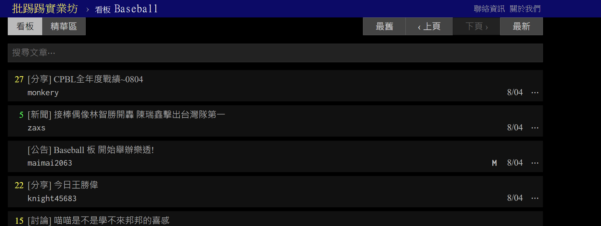

# PTT_NotiMail

## 1. Motivation
PTT has been the most famous Bulletin Board System (BBS) in Taiwan since its debut in 1995. Many users still share and acquire useful information from PTT everyday and I happen to be one of them. In order to make the platform even more convenient, I created this PTT NotiMail project so that you can specify board name and keywords of interest. Then the program will perform the search automatically for you and send emails with hyperlink to you.

## 2. Introduction
There are more than 10000 boards in PTT. The information flux within several hot boards could be incredible and hard to track. In this project, I created a Python program that allows you to type in board name and keyword information in information.json and the program will perform web scraping on those boards of interest. Eventually, the program will list all articles containing keywords with hyperlink in e-mail and send it to specific mail account. Below is the screenshot of a popular board "Baseball" in PTT.

## 3. Project Structure
### Directory and Files
- Functions  
    |- scraping.py: This python script contains all functions required for PTT webpage scraping. We first load information.json for information and then retrieve                           content list till the day before last check time. Finally, we extract title and date information from web div content and compare with keywords to                     further filter desired content.
    
    |- send_email.py: This script is responsible for sending emails containing link to PTT page having desired keyword.
- main.py: This is the main python script that calls functions in functions directory and pipe them into workflow. The script also helps print out status of operation  so that users can read the progress when it's running.
- information.json: You can specify board name("forsale" and "Baseball" in this example) and keywords as well as email receiver in this json. Be careful of case of board_name(The naming rule could vary from board to board in PTT) as well as special characters(for example:"nb-shopping","ONE_PIECE").
  ~~~
  {
    "forsale": 
      {"last_check_time": "2022-08-04", 
       "keywords": ["即享", "myprotein", "家樂福"], 
       "email_receiver": "aritek5x1@gmail.com"}, 
    "Baseball": 
      {"last_check_time": "2022-08-04", 
       "keywords": ["柏融", "WBC", "中華"], 
       "email_receiver": "aritek5x1@gmail.com"}
  }
  ~~~
- mail_template.txt: Basically this is just a text template for email body, you don't have to modify it.
- ptt_notimail.bat
  This is a batch file for Windows command prompt to execute the python program. Adjust the cd part to your project directory and run python main.py to execute.
  ~~~
  @echo off
  cd Your_project_directory
  python main.py
  pause
  ~~~
### Python libraries
- re: We utilized re library to extract information from plain text
- BeautifulSoup: We use BeatifulSoup to get and process response from PTT
- requests: We use requests to make requests from PTT
- json: To deal with reading and writing json files
- datetime: Deal with date and time 
- email.message.EmailMessage: To build email oject
- ssl- For email safety 
- os: To read environment variable from system(Gmail app password in this case)
- smtplib: This library is crucial for sending emails because it helps with connection to Gmail SMTP server

## 4. How to deploy to your own device
- 1. Register app password from one of your gmail account. You may check this <a href="https://www.youtube.com/watch?v=g_j6ILT-X0k">Youtube video</a> for tutorial.
- 2. Download or clone this repository to your local device
- 3. Modify information.json file according to your demand
- 4. Rewrite the directory path within ptt_notimail.bat batch file
- 5. Double click the batch file whenever you want to run keyword search (or your can put shortcut of the batch file to startup folder to automatically run when startup)=>Follow <a href="https://www.youtube.com/watch?v=g_j6ILT-X0k">instruction from Microsoft</a> 
- 6. Or you can use any form of execution of the main.py file.

## 5. Summary
This simple python program helps you track the keyword of certain PTT board content, minimizing your waste of time viewing a lot of content. The e-mail also provides direct URL to the PTT page, making this application more practical. However, there could still be improvement or some advanced function. If you are interested in this, you may email me for some advice. Thanks in advance!

## 6. Acknowledgement
Thanks for those who devote to the maintenance of PTT so that we can enjoy the convenience from it. Also thanks to those who dedicated themselves to open sourced software and resources.
